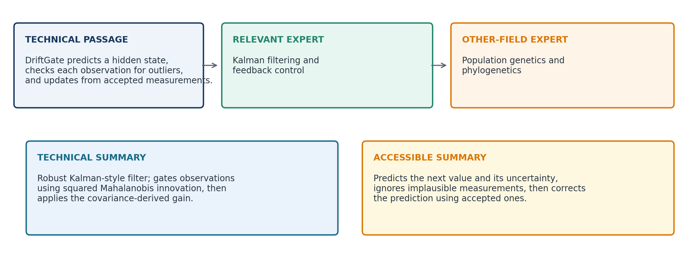
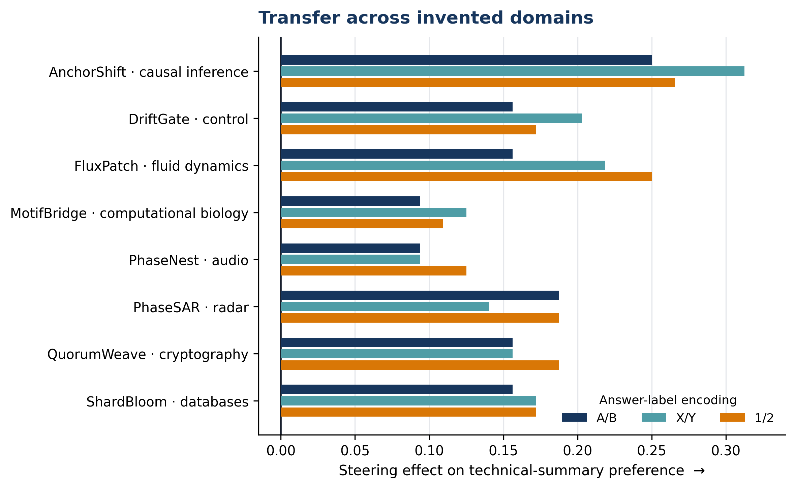
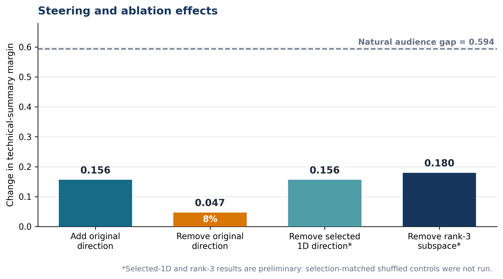
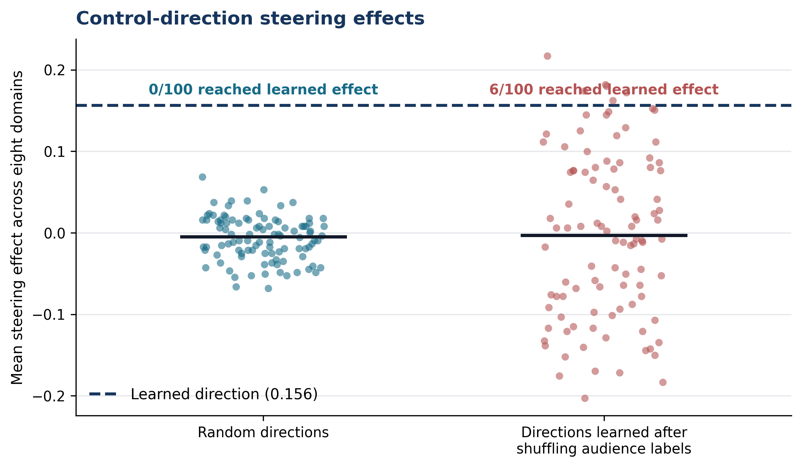

# Does a Language Model Know Which Expert It Is Talking To?

This project tests whether a language model represents **the relevance of a reader's expertise**, and whether that representation can control its preference for a technical rather than accessible explanation.

Instead of comparing an expert with a novice, I compare two equally technical readers: one is an expert in the passage's field and the other is an expert in an unrelated field. Both see the same passage and the same two accurate summaries. The main outcome is the log-probability difference between the technical-summary and accessible-summary answer labels.

The result is deliberately narrow. In Qwen3.5-4B, an audience-contrast direction is readable and can steer forced-choice summary preference, but removing it explains only a small part of the model's unmodified behaviour. The result does not reliably transfer to free generation or to Phi-3.5 Mini.

## Main findings

- Both Qwen2.5-3B and Qwen3.5-4B prefer the technical summary more when the stated reader has relevant expertise.
- A direction learned from eight real ML topics increases technical-summary preference in all eight held-out invented domains. This remains 8/8 after changing answer labels from A/B to X/Y and 1/2 and after rewriting the reader profiles.
- Unmodified activations separate the two reader conditions along this direction (AUC 0.809; 0.836 with rewritten profiles).
- None of 100 isotropic random directions matches the learned steering effect, but 6/100 shuffled-label directions do. The direction is therefore not cleanly specific to the intended audience labels.
- Removing the original direction reduces only 0.047 of the natural 0.594 audience gap, about 8%.
- A rank-3 SVD subspace removes 0.180 of the gap, but a validation-selected one-dimensional mixture inside that subspace nearly matches it. Three necessary dimensions are not established.
- Steering does not reliably change a preregistered technical-term metric in 160 freely generated gists.
- Phi-3.5 Mini shows a positive average intervention effect but fails the label, control, and ablation checks. I do not treat this as cross-family replication.

The main lesson is that **a direction can encode a behavioural contrast and steer an answer while explaining little of the computation the unmodified model normally uses**.

## Experiment



The learned direction is the difference between mean residual-stream activations for relevant-domain and unrelated-domain expert profiles. The main Qwen3.5-4B direction is extracted at layer 17 from the final prompt token and applied at all token positions in that layer.



The project separately tests:

1. **Behaviour:** does stated relevant expertise change the model's choice?
2. **Representation:** can the reader contrast be decoded from unmodified activations?
3. **Sufficiency:** does adding the direction change the answer?
4. **Necessity:** does removing the direction reduce the natural audience effect?
5. **Specificity:** do random or shuffled-label directions work equally well?
6. **Generality:** does the result survive new domains, label tokens, profile wording, free generation, and another model family?





## Models and data

- **Main model:** `Qwen/Qwen3.5-4B`
- **Initial behavioural comparison:** `Qwen/Qwen2.5-3B-Instruct`
- **Cross-family test:** `microsoft/Phi-3.5-mini-instruct`
- **Discovery set:** eight real ML methods/topics
- **Prospective set:** eight invented methods from unrelated technical fields
- **Primary metric:** log P(technical label) - log P(accessible label)

The prospective methods are synthetic and the candidate summaries received only light human review. This is an important limitation, not a substitute for a larger expert-validated dataset.

## Repository layout

- `report/` — the [executive summary](report/EXECUTIVE_SUMMARY.md), [full report](report/FULL_REPORT.md), detailed experiment records, and figures
- `protocols/` — prospective and follow-up protocols
- `data/` — passages, reader profiles, and candidate summaries
- `results/` — result tables, configurations, generations, controls, and saved directions
- `scripts/` — experiment, analysis, data-building, and plotting code; see its index for the main entry points

## Setup

The experiments require a CUDA-capable GPU and download model weights from Hugging Face.

```bash
python -m venv .venv
source .venv/bin/activate
pip install -r requirements.txt
```

The main fixed-direction prospective test can be rerun with:

```bash
python scripts/fixed_direction_transfer.py \
  --model Qwen/Qwen3.5-4B \
  --discovery data/stimuli_domain_matched_8.json \
  --test data/stimuli_prospective_synthetic.json \
  --output-dir results/reproduction_fixed_direction
```

The committed `results/` directory contains the outputs used in the report, so the conclusions can be inspected without rerunning the models.

## Scope

This is evidence for linear control of a forced-choice summary preference in Qwen3.5-4B. It is **not** evidence for a universal explanation-depth mechanism, reliable control of generated explanations, or a shared mechanism across model families.

## AI assistance

Codex was used heavily for implementation, experiment orchestration, plotting, and first-pass prose. I chose the research question, decided which claims required further tests, manually checked the main stimuli and figures, and rejected or revised interpretations that were not supported by the results.

## Author

Nikhil Makkar
