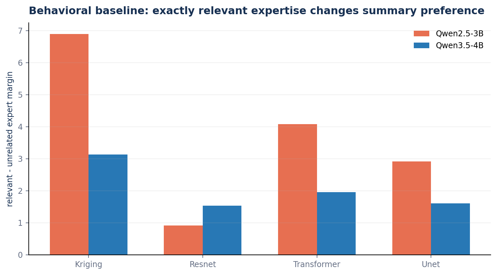
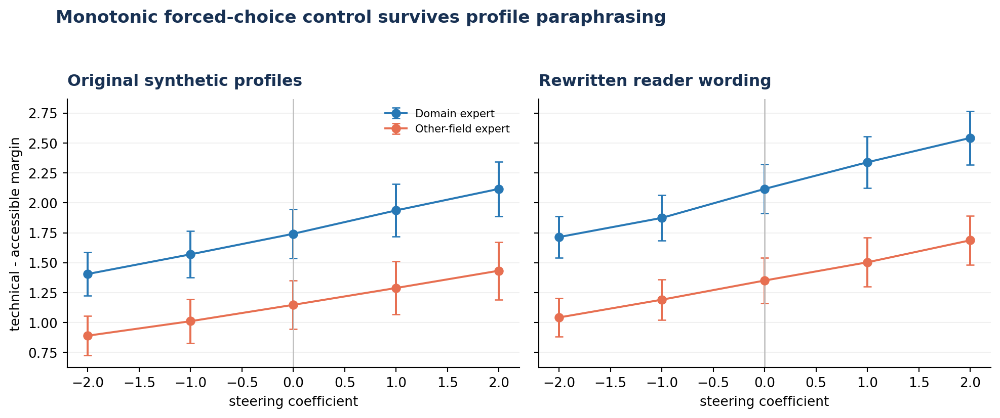
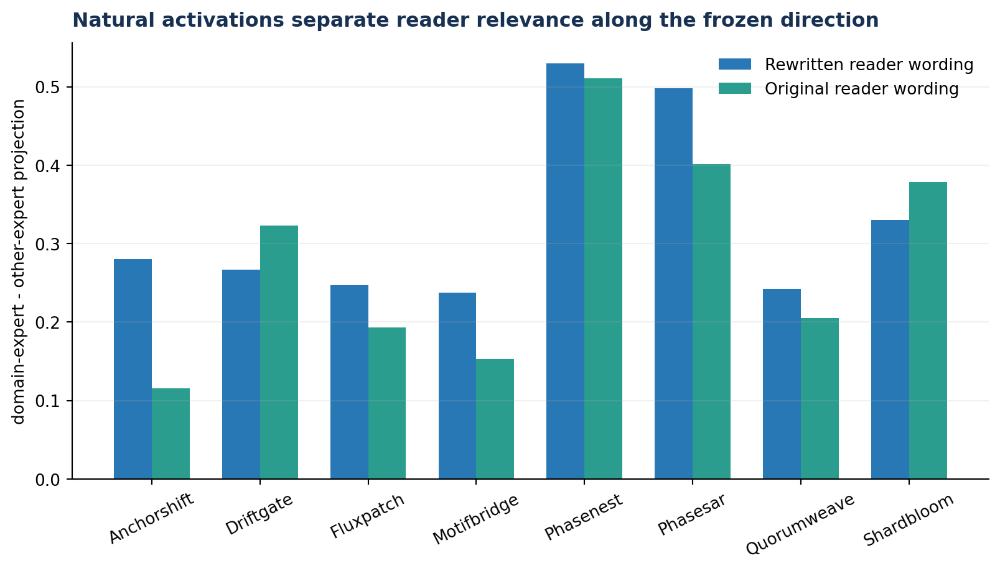
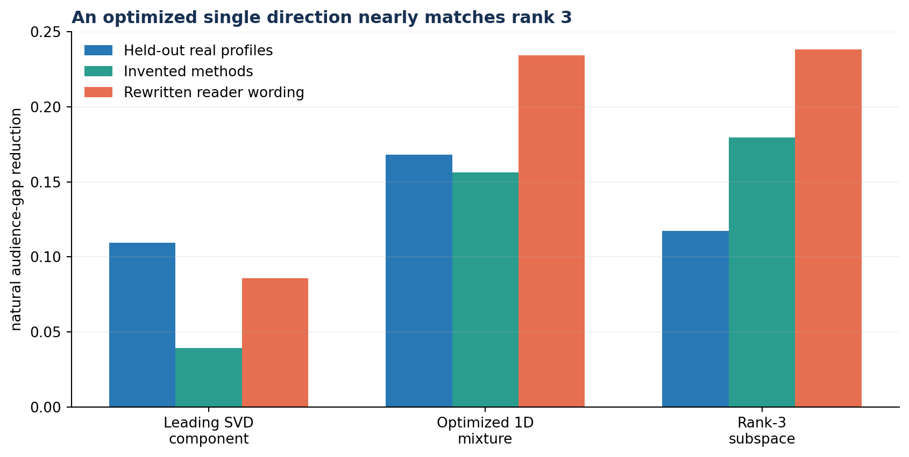
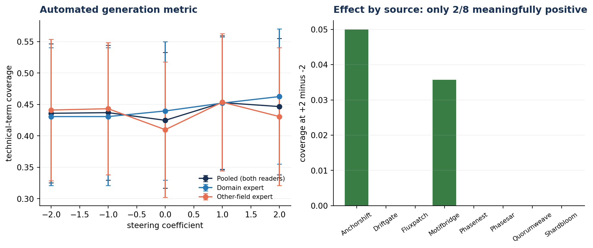
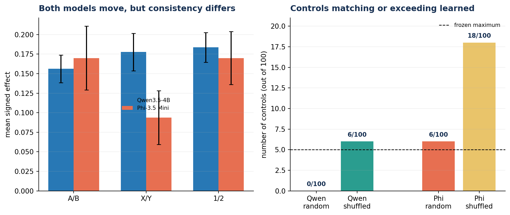

# Is Explanation Depth Audience-Conditioned?

## Full Report

## The Question

This project started from a small but recurring frustration. When I ask my regular AI apps for the gist of a paper, they often remove exactly the technical terms that would make the explanation shorter and more useful. Instead, I get definitions, generic analogies and sometimes a long story explaining something I already know (or sometimes even completely unrelated).

At first my question was very broad: does the model know what the reader knows, and can this be controlled internally? That phrasing sounds nice but is almost impossible to test. “Expertise” can mean knowledge of a field, general sophistication, familiarity with one method, confidence, preferred writing style, or simply that the prompt contains the word expert.

So I narrowed the project to a measurable question (which is obviously not perfect - it's just relatively easily measurable):

> When a prompt states the reader’s expertise, does a language model represent whether that expertise is relevant to the passage? Can a direction in its activations control whether it prefers a technical or accessible summary?

To be very clear, I am not testing whether the model has a complete representation of a person, and I am not testing broad behaviours such as sandbagging. I am studying one controlled instance in which changing the stated reader changes the model’s preferred answer.

The work is methodologically inspired by activation-steering studies such as ‘Refusal in Language Models Is Mediated by a Single Direction’ (https://arxiv.org/abs/2406.11717) and ‘Understanding Reasoning in Thinking Language Models via Steering Vectors’ (https://arxiv.org/abs/2506.18167). Those papers study much cleaner behavioural targets. Audience-appropriate explanation is subjective, which made it especially important to separate the different claims I could make.

I use four levels of evidence throughout the report:

1. Behaviour: does the unmodified model change its answer when the reader changes?

2. Representation: can the reader contrast be read from normal activations?

3. Causal influence: does adding or removing the activation feature change the answer?

4. Generalisation: does the result survive new domains, prompt wording, answer labels, free generation and another model family?

## Making the question measurable

To make the questions measurable I did not compare an expert with a novice, which was my first instinct. But I realized that then defining novice and expert would be too hard and the variables would be too many - creating an issue which property should be related to which variable or whether it was any of the considered variables at all? To simplify this I considered two technical readers/users:

- one expert in the field of the passage;

- one expert in an unrelated field.

Both readers receive the same technical passage, the same instruction and the same two candidate summaries. One candidate is concise and retains domain terminology. The other explains the same mechanism more explicitly in accessible language. Both are intended to be accurate. Only the relevance of the reader’s expertise changes.

*Figure 1. Example of the controlled comparison (not a result)*

Held-out example using an invented method:

> Passage: DriftGate estimates a hidden dynamical state from noisy controls and observations. It alternates a linear prediction with a measurement update, rejecting observations whose covariance-normalised innovation is above a fixed gate.

> Expert reader: The reader is deeply familiar with state-space estimation, Kalman filtering and feedback control. They want the core idea explained concisely.

> Unrelated expert: The reader is deeply familiar with population genetics and phylogenetic reconstruction. They want the core idea explained concisely.

> Technical summary: DriftGate is a robust Kalman-style filter that propagates state covariance, gates observations by squared Mahalanobis innovation and applies the covariance-derived gain only to accepted measurement updates.

> Accessible summary: DriftGate tracks a changing hidden quantity by first predicting its next value and uncertainty, then correcting that prediction with new measurements. It ignores measurements that are implausibly far from the prediction and trusts accepted measurements according to their noise.

In the main experiments the model does not generate an explanation. It chooses between labelled candidates.

I measure

m = log P(technical label) - log P(accessible label)

A positive margin means the model prefers the technical summary. The audience gap is the margin for the relevant expert minus the margin for the unrelated expert. Candidate order and prompt variants are balanced, averaged within a domain, and the domain, not each repeated prompt, is treated as the independent unit.

This forced-choice setup is less realistic than free generation. I used it because it gives a clean outcome and keeps summary content and correctness fixed. I later return to free generation as a separate external-validity test.

## Was there actually a behaviour to explain?

Before looking at activations I checked whether changing reader relevance affected the unmodified model at all. This matters because a direction cannot explain an audience-conditioned behaviour that does not exist.

The early experiments also exposed the original confound. Both Qwen models reacted strongly to broad “expert” cues, including expertise unrelated to the passage. After switching to matched experts, the remaining exact-relevance effect was smaller. Qwen3.5-4B showed the cleaner and more consistent effect, so it became the main mechanistic model. Qwen2.5-3B remained useful as an initial behavioural comparison rather than evidence for the complete mechanism.

*Figure 2. The matched-expert comparison asks about relevant knowledge rather than generic   sophistication. The Qwen3.5 result was consistent enough to justify investigating its activations.*

## Extracting a direction

For each prompt I recorded the residual-stream activation at the final prompt token. A simple audience-contrast direction is the mean activation for relevant experts minus the mean for unrelated experts:

                v = 𝔼[h | relevant expert] − 𝔼[h | unrelated expert]

I swept layers and token positions on validation data rather than choosing a convenient-looking location after seeing the final test. The main fixed direction came from layer 17 and the final prompt token in Qwen3.5-4B.

There were still two easy ways to fool myself:

1. a vector could encode the particular ML topics used to construct it;

2. a vector could be refitted separately for every test domain and therefore never demonstrate one common feature.

I addressed these in two stages. First, leave-one-domain-out experiments learned a direction on seven real domains and tested it on the excluded eighth. Addition was positive in all eight held-out domains. Then I used the stricter test: learn one direction once from all eight real ML domains, freeze its layer, token position, norm and coefficient, and apply it unchanged to eight invented technical methods from unrelated fields.

The invented methods included control, causal inference, numerical fluid dynamics, databases, computational biology, radar, cryptography and audio processing. They were self-contained descriptions rather than known papers, reducing the possibility that a memorised title-summary pairing determined the answer.

## The fixed direction transferred

The frozen Qwen3.5 direction increased preference for the technical summary in all eight invented domains. The mean effect was 0.156 using A/B answer labels. Changing the answer labels to X/Y and 1/2 gave mean effects of 0.178 and 0.184, again positive in every domain.

*Figure 3. Changing labels from A/B to X/Y or 1/2 to check for models internal bias on results*

With eight independent domains all having the predicted sign, the exact one-sided sign-flip probability is (1/2^8=0.0039) for each encoding. I use this test because the number of domains is small and I do not want repeated prompt variants to create artificial precision.

I also tested whether the effect behaved like a control axis rather than a single lucky comparison. Across coefficients (-2,-1,0,1,2), technical-summary preference increased monotonically for both reader conditions and all three answer encodings. The same pattern survived replacing every reader-profile carrier sentence with wording not used during direction extraction.

*Figure 4. Increasing the coefficient moves the forced-choice margin in the predicted direction. Rewritten profiles show the same behavior.*

At this point the direction looked surprisingly robust with new topics, invented mechanisms, new answer tokens and new profile wording all giving the same qualitative result. But this established only that the direction was sufficient to influence the forced-choice answer. It did not show that the unmodified model naturally represented or relied on it.

## Could the audience contrast be read from normal activations?

For the representation test I did not alter the model. I projected the unmodified activations onto the frozen direction and asked whether relevant-expert prompts landed above unrelated-expert prompts.

The within-domain projection gap was positive in all eight invented domains. Pooling the ranking information gave an area under the ROC curve (AUC) of 0.809. After rewriting every reader profile, the gap remained positive in all eight domains and AUC increased to 0.836.

*Figure 5. Relevant readers project higher within every domain. The separation transfers better as a relative within-domain signal than as one globally calibrated threshold.*

AUC here has a simple interpretation: if I randomly take one relevant-reader activation and one unrelated-reader activation, the projection ranks the relevant one higher roughly 81–84% of the time. A fixed threshold transferred less well 62.5% accuracy on the original invented profiles and 71.9% after rewriting, so the relative separation is stronger than absolute calibration.

## Was the steering effect special?

Neural networks are high-dimensional and sensitive to intervention. A direction changing the answer is not interesting if any vector with the same norm does the same thing.

I used two controls:

- Random directions: isotropic vectors matched to the learned direction’s norm. These test whether an arbitrary perturbation works.

- Shuffled-label directions: the full extraction pipeline is repeated after destroying the relevant-versus-unrelated labels. These are a harder control because they preserve structure in the prompt activations while removing the intended semantic grouping.

The real direction subtracts the mean of all unrelated-expert activations from the mean of all relevant-expert activations. For each shuffled control, I instead pooled the discovery activations and randomly divided them into two equally sized groups, ignoring the real audience condition. I then subtracted one random-group mean from the other and normalised the resulting vector to the same norm as the learned direction. The control used all discovery activations and repeated this process with 100 random assignments.

This preserves the geometry and structure of real prompt activations but removes the proposed meaning. If these shuffled directions steer equally well, the extraction procedure may be finding generally influential axes rather than something specific to audience relevance.

None of 100 random directions matched the learned aggregate effect. However, six of 100 shuffled-label directions matched or exceeded it.

*Figure 6. Steering effects of all random and shuffled-label control directions compared with the learned direction*

Therefore I do not treat the fixed intervention direction as uniquely specific to audience relevance.

## Ablation

Adding the direction helped in understanding whether it can influence the answer. I used ablation to understand how much the unmodified model is relying on it? Simply put - if I remove it is it going to change the output and by how much.

Removing the direction reduced the audience gap in seven of eight domains. However, the average reduction was only 0.047, about 8% of the original 0.594 gap, so most of the behaviour remained.

*Figure 7. Comparison of steering and ablation effects against the natural audience gap.*

This result made the clean single-direction story difficult and provided evidence for the other possibilities. The direction was readable and steerable, but weak as a mediator of the normal decision. In other words, the model can be pushed using a feature without depending heavily on that exact feature by default.

## One direction vs Subspace

From my initial intuition of expertise being dependent on several variables I wanted to see if instead of single direction may this could be represented as a subspace.

For this, I formed one relevant-minus-unrelated contrast vector for each of the eight real discovery domains, stacked them, and applied uncentred singular value decomposition (SVD). Uncentred SVD was used because centring would remove the shared mean contrast I wanted to study. The resulting components are ordered by how much variation in the eight contrast vectors they capture.

I ablated nested subspaces with ranks from one to eight. The maximum possible learned rank was eight because there were only eight domain-contrast vectors.

The leading SVD component removed 0.039 of the natural gap. The rank-3 subspace removed 0.180, or about 30%, and the result was positive in all eight invented domains. No rank-matched random subspace out of 100 matched it, while two of 100 shuffled-label rank-3 subspaces did. Rank 7 removed more of the raw gap, but its shuffled-label specificity was weaker.

My first interpretation was that the behaviour was low-rank but not rank-1. But that was premature.

As we know SVD orders components by variance. It does not know which direction has the greatest causal effect on the output. Out of curiosity I tested whether three dimensions were actually necessary, I searched for a single direction inside the rank-3 span using only real-domain validation profiles. I froze the selected mixture and evaluated it on untouched data.

*Figure 8. Held-out ablation performance of the variance-leading direction, a validation-selected one-dimensional mixture and the complete rank-3 subspace.*

The selected one-dimensional direction removed:

- 0.168 on held-out real profiles, compared with 0.117 for rank 3;

- 0.156 on invented methods, compared with 0.180 for rank 3;

- 0.234 after rewriting profiles, compared with 0.238 for rank 3.

All three selected-direction effects were positive in all eight domains. So I found that variance leading direction is not the most causally effective direction and a small learned subspace contains a much better one-dimensional causal axis.

This correction is itself preliminary. I selected the direction from many candidate mixtures but did not repeat the complete selection procedure inside many shuffled-label subspaces.

## Free generation

Selecting from options is not how the models are designed to be used. Most of their work is around answering questions in one or the other form.So this had to be tested. It was harder to measure.

I generated 160 short explanations: eight invented methods × two reader types × two ways of describing the reader × five steering strengths.

Before seeing the results, I decided to measure how many method-specific technical terms appeared in each explanation. If steering worked, stronger positive steering should have increased the use of these terms.

It did not. Moving from -2 to +2 changed technical-term coverage by only 0.011, and the expected increase appeared in just two of eight domains. Looking at all five steering strengths gave the same result: only three domains showed a positive trend. The outputs also became slightly shorter, but not enough to explain the missing effect.

*Figure 9. Technical-term use remained almost flat as steering strength increased.*

This metric is imperfect. A model can explain something technically without using the exact terms in my list, and counting terms does not measure whether an explanation is correct or useful. Still, this experiment failed on the metric I chose beforehand.

## New model family - Transferability

Qwen2.5 and Qwen3.5 provided initial evidence to move forward with the experiments but the existence of the behavior can not be generalised (no matter how limited the generalisation) without checking on a different model family. I therefore repeated the same experiment on Phi-3.5 Mini. I selected layer 12 using only the real ML examples, before testing it on the eight invented methods.

Phi produced positive average steering effects: 0.170 for A/B, 0.094 for X/Y and 0.170 for 1/2. But average hid the more important results.

- X/Y was positive in only six of eight domains,
- six random controls matched the A/B aggregate,
- 8 shuffled-label controls matched it, and
- only two individual domains exceeded their isotropic 95th percentiles.
- Selected-layer and all-layer ablation were also inconclusive.

*Figure 10. Qwen and Phi steering effects together with their random and shuffled-label controls. Positive average steering is not sufficient for replication. Phi failed the robustness, specificity and ablation criteria.*

I therefore found no cross-family replication of a direction-specific audience-relevance feature.

## Compilation

Concrete results which are narrow and tells us that one frozen residual-stream direction in Qwen 3.5-4B:

- separates relevant from unrelated reader/user profiles in unmodified activations;

- transfers from real ML topics to eight invented methods;

- changes the forced-choice technical-summary margin in every test domain;

- survives answer-label changes, reader-profile rewriting and a dose-response test;

- causes little change to ordinary next-token prediction.

But there are limitations to those results:

- shuffled-label extraction occasionally produced equally strong steering;

- removing the original direction explained only 8% of the natural audience gap;

- rank 3 removed more, but a selected single direction nearly matched it;

- the automatic free-generation result failed;

- No replication in different families of models.

## Limitations

There are several important limitations which I am aware of (there could be more which I am missing):

* The main experiment is not free generation. The model chooses between two summaries written beforehand. This is much easier to measure, but it is not the same as asking the model to write an explanation. In fact, I did not find the same effect in free generation.

* There are only eight training domains and eight test domains. I used many prompt variations, but those are not independent samples. The real sample size is still eight domains, so the exact numbers could change with a larger and more diverse set.
* The test methods are invented. This was useful because the model could not simply remember a familiar paper and its summary. However, these passages are shorter and cleaner than real papers and may be easier for the model to understand.
* The summaries may not be perfectly matched. I tried to make the technical and accessible summaries equally correct and useful. I manually checked the small prospective set, but there was no large review by experts from every field.
* The selected one-dimensional result may be optimistic. I searched through many directions inside the rank-3 subspace and selected the best one using validation data. I kept the test data separate, but I did not repeat the same search using many shuffled-label subspaces. It is possible that searching many candidates would also find a strong direction from meaningless labels.
* The free-generation metric was limited. I measured whether the generated explanations used predefined technical terms. A good technical explanation may use different wording, while an incorrect explanation may still repeat the expected terms. Human evaluation would be better for measuring usefulness and correctness.
* I did not identify a complete circuit. I studied directions in the residual stream and tested different layers and token positions. I did not identify which attention heads or MLPs create and use the audience signal.

## Future Work

I started this project by treating audience relevance as one binary contrast. I would tackle the same problem again by making dimensionality part of the experimental design from the beginning - to be honest I do not how yet but it could be something like adding 2 or 3 types of specific pre-requisites and see if model somehow represent them separately or the whole knowledge as a single signal.

## Experimental details

* Main model: Qwen3.5-4B
* Behavioural comparison: Qwen2.5-3B and Qwen3.5-4B
* Cross-family test: Phi-3.5 Mini
* Discovery data: Eight real ML methods and topics
* Prospective test data: Eight invented methods from unrelated fields
* Activation location: Residual stream, layer 17, at the final prompt token
* Direction: Mean relevant-expert activation minus mean unrelated-expert activation
* Primary outcome: Log probability of the technical-summary label minus log probability of the accessible-summary label
* Main intervention: Add the frozen direction at the selected residual-stream layer
* Removal test: Remove the direction from all token positions at the selected layer
* Controls: 100 norm-matched random directions and 100 shuffled-label directions
* Free generation: Greedy decoding at five steering strengths: −2, −1, 0, +1 and +2

## References

1. Arditi, A., Obeso, O., Syed, A., Paleka, D., Panickssery, N., Gurnee, W. and Nanda, N. (2024). Refusal in Language Models Is Mediated by a Single Direction (https://arxiv.org/abs/2406.11717).

2. Venhoff, C., Arcuschin, I., Torr, P., Conmy, A. and Nanda, N. (2025). Understanding Reasoning in Thinking Language Models via Steering Vectors (https://arxiv.org/abs/2506.18167).
